## 1- Install STM32CubeProgrammer
Download from the offical website

```bash
    https://www.st.com/en/development-tools/stm32cubeprog.html
```

## 2- Install Arduino IDE
Download the appimage from the offical website

```bash
   https://www.arduino.cc/en/software
```

### Install STM32 Add-on to Arduino IDE
- In your Arduino IDE, go to File > Preferences

- Add the URL below to Additional Board Manager URLs text box:

```bash
    https://github.com/stm32duino/BoardManagerFiles/raw/main/package_stmicroelectronics_index.json
```
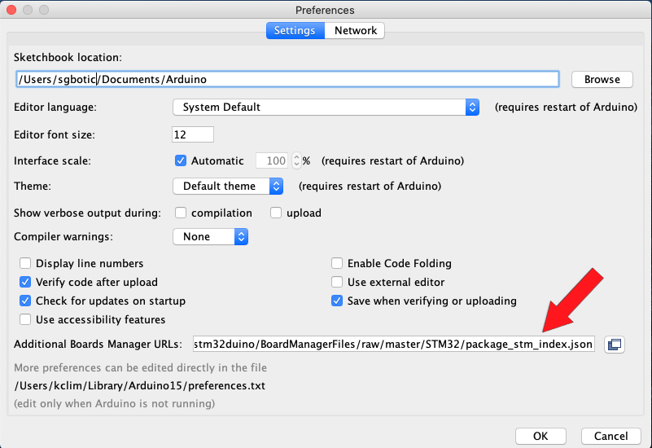

- Go to Tools > Board > Boards Manager

- Search for STM32, select latest version and click Install.

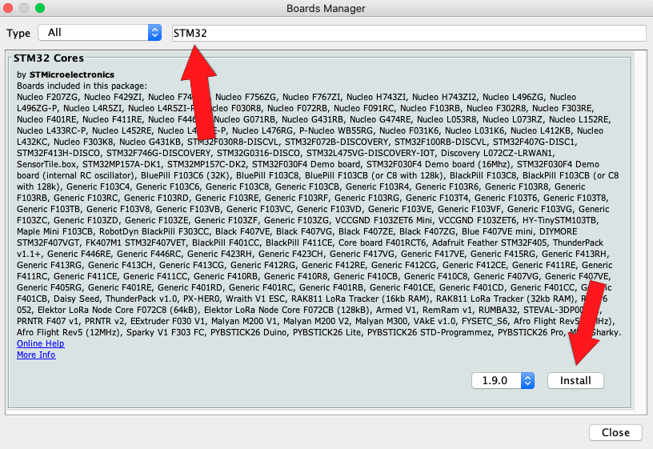

- Once the installation is completed, quit and restart the Arduino IDE.


## 3-Upload the bootloader using STM32CubeProgrammer 

- Clone the bootloader github repository or download the bin file only
```bash
    https://github.com/rogerclarkmelbourne/STM32duino-bootloader/blob/master/binaries/generic_boot20_pc13.bin
```

- Connect to the STM via St-Link

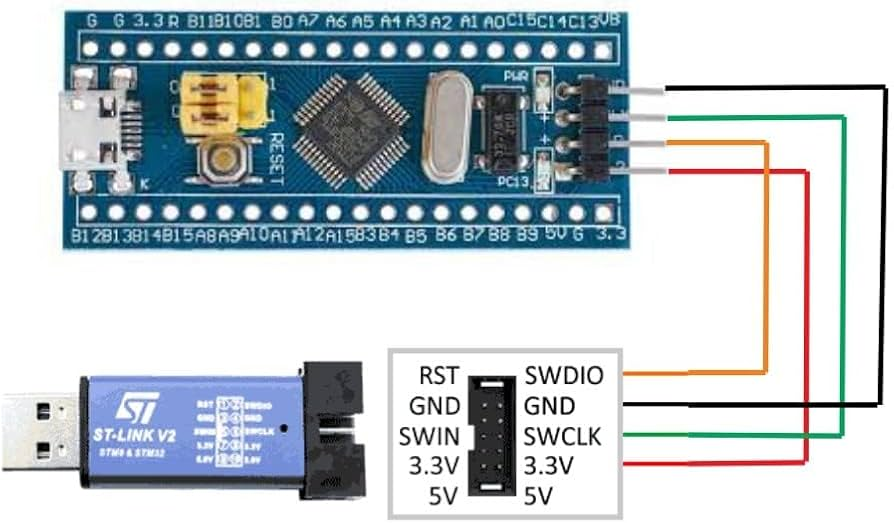

- Open STM32CubeProgrammer

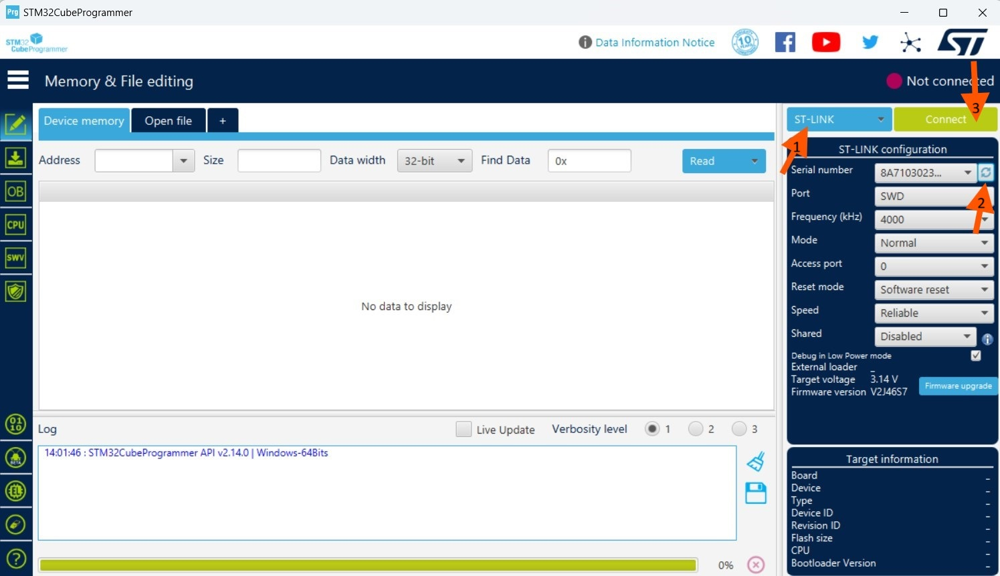

- connect to STM, browse the bootloader path, and start uploading

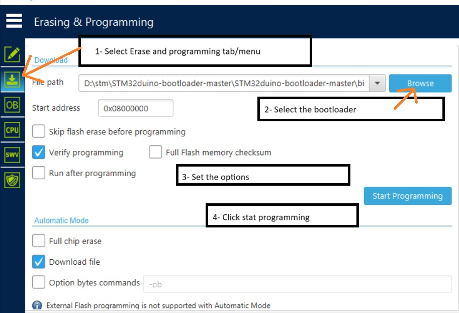

### If you don't have an ST-Link, you can use a TTL instead

- Switch the STM to programming mode and connect it via TTL

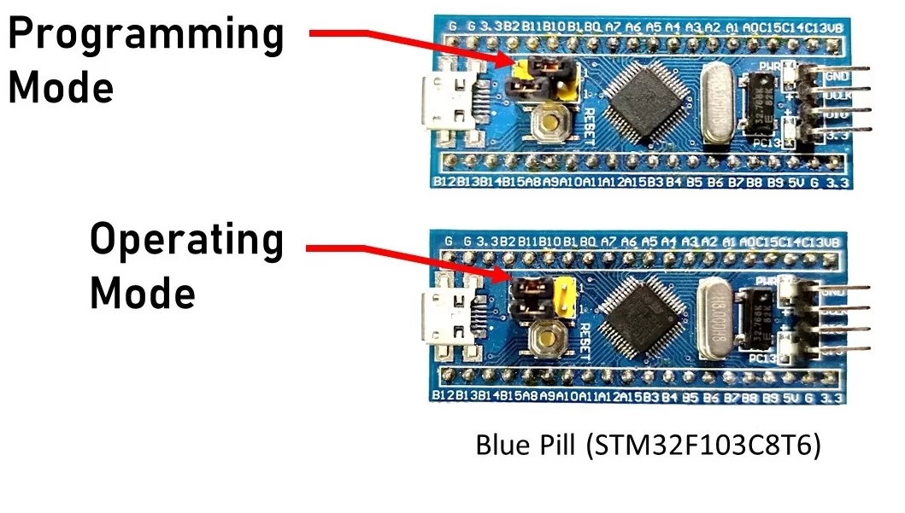

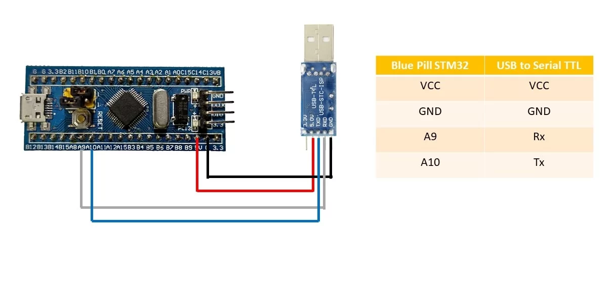

- Upload the bootloader, then make sure to switch the STM back to operation mode.

### Note: The bootloader only needs to be uploaded once. After it’s uploaded, you can proceed to upload sketches or code to the board directly using the Arduino IDE.

## 4- Installing Necessary Drivers

- Download or clone that repo (if you downloaded as ZIP. Extract the contents and rename the folder as “Arduino_STM32)
```bash
    https://github.com/rogerclarkmelbourne/Arduino_STM32
```
- Copy this folder and paste it in “C:\Users\abdalla\Documents\Arduino\hardware” directory. 
    -- replace abdalla with your username.
    -- If the directory Arduino\hardware is not present, then create one.

- Open command prompt with admin rights and navigate to the directory
```bash 
    C:\Users\abdalla\Documents\Arduino\hardware\Arduino_STM32\drivers\win
```
- Run the “install_drivers.bat” file first. This will install the Maple DFU Driver and Maple Serial Driver.
- Also, run the “install_STM_COM_drivers.bat” file to install the STM Serial Driver.

## 5- Setup Arduino IDE
- Connect STM32 Blue Pill to your computer USB port.

- From the Tools > Board > STM32 Board, select Generic STM32F1 series

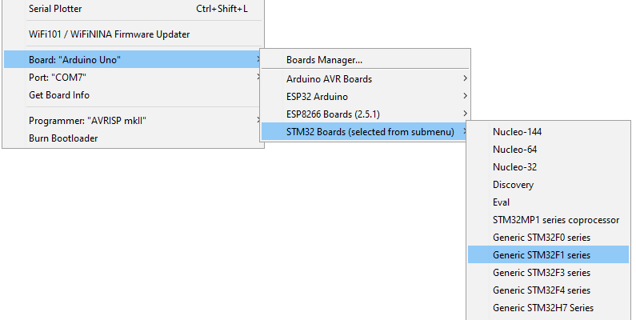

- Select Tools > Board Part Number > Blue Pill F103C8

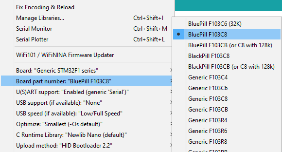

- Under USB Support, select CDC (generic "Serial" supersede U(S)ART)

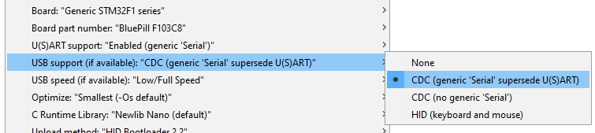

- Under Upload method, select Maple DFU Bootloader 2.0

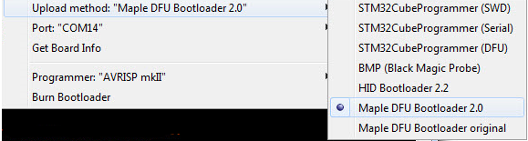

- Compile the sketch and upload
